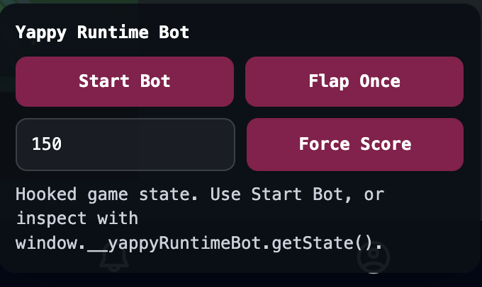

YipYap is a small Irish social network that's become something of a hidden gem, but when they announced the release of a game — with a LEADERBOARD — I just couldn't resist messing with it.

## Background
In order to understand how I managed to break the leaderboard, we must first understand the game and its potential weaknesses. The game is a Flappy Bird clone, and it works effectively the same as the original game, but using JavaScript and Next.js components to host the game. There isn't anything exotic going on, and I immediately identified my first route to break the leaderboard.
## The Bot
I vibecoded a Flappy Bird bot. I used Codex to analyse the game sources and carefully craft a script that would attach itself to the game process. The bot used the bird draw call to figure out where it was, used pipe draw calls to know where the gaps were, and it was a matter of tuning the bot to make it good.

This worked... kind of. The bot sometimes struggled in the early stages of the game, and when the speed began to pick up, it often found itself in a bad position when the next pipe came along. The high score was 171, and surprisingly nobody noticed what was going on. I could've stopped here, as I was #1 — but it didn't feel like a victory. I wasn't looking just to get first place, I wanted a ridiculous score, for the laugh.

So I went looking for a lazier approach.
## The Injection
Originally I ruled this out, as I didn't expect it to be very easy. Codex wouldn't help either — it turns out injecting scores into a live leaderboard is apparently "unethical". Funny, given it had no problem helping me build the bot.

However, while inspecting the YappyBird runtime, I noticed that the variable controlling your score is directly exposed to the user. Better yet, the leaderboard is updated with a simple POST request using that variable. The server handling leaderboard updates completely trusts the client, and makes no attempt to verify the data it receives.

As a result, I simply reused the runtime hook from earlier and added my own extra component to the UI.



The code below also contains some leftover attempts to change the game speed — part of an experiment that never went anywhere. This code is also edited to remove API-specific values, attempting to run this will not work, and that's intentional.


```js
overlay.querySelector("[data-role='apply-score']").addEventListener("click", () => {
  const state = gameInstance.currentState;
  const nextScore = Number.parseInt(scoreInputEl.value, 10);
  if (!state || !Number.isFinite(nextScore) || nextScore < 0) {
    setStatus("Invalid score.");
    return;
  }
  state.points = nextScore;
  state.highPoints = Math.max(state.highPoints || 0, nextScore);
  setStatus(`Score set to ${nextScore}`);
});
```

And that's it! The leaderboard immediately updated with the set value, and YappyBird was successfully defeated.

## The Aftermath

Unfortunately, shortly after the score was posted and people began noticing, the YipYap developers logged in and immediately caught me. The score stayed up for less than an hour. Hey, at least I didn't get banned!

As far as I know, they still haven't patched the bug, so I will not be sharing the source code for now. If that changes, you'll find it [here](https://github.com/93kimo/Yappybot/).
## Conclusion
This was a very fun way to waste time over the holiday break, and I actually learned a lot from the experience. If the YipYap devs read this — no hard feelings. The game is well put together, and people like me are hardly a reasonable expectation to program against. If you'd like to see the full code, just get in touch through my account on YipYap.

Thanks for reading!